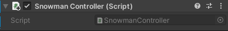

Select your Player GameObject and choose **Add Component** in the Inspector and add a **Character Controller**.

Adjust the collider settings so that the collider is same height as the Player and the Center y value is half that of the height. Adjust the radius so that the collider covers your Player. 

The Character Controller component adds the `SimpleMove` method, which you will need to call from `Update` on a script attached to the Player. 

Click **Add Component**, then **New script**. Name the script `SimpleController` (or use a name specific to your character such as `SnowmanController`.)

Click on the script in the Inspector to find it in the Project window, then open the script in your Code Editor. 

Add code to move your character based on keyboard inputs. 

--- code ---
---
language: cs
filename: SimpleController.cs
line_numbers: false
---
public class SimpleController : MonoBehaviour
{
    public float moveSpeed = 3.0f; // Default move speed
    public float rotateSpeed = 3.0f; // Default rotate speed

    // Start is called before the first frame update
    void Start()
    {
        
    }

    // Update is called once per frame
    void Update()
    {
        CharacterController controller = GetComponent<CharacterController>();
        transform.Rotate(0, Input.GetAxis("Horizontal") * rotateSpeed, 0);
        Vector3 forward = transform.TransformDirection(Vector3.forward);
        float speed = moveSpeed * Input.GetAxis("Vertical");
        controller.SimpleMove(forward * speed);
    }
}
--- /code ---

