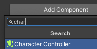

Sélectionne ton GameObject Joueur et choisis **Add Component** dans l'Inspector et ajoute un **Character Controller**.

Ajuste les paramètres du collider de façon à ce qu'il soit de la même hauteur que le joueur et que la valeur de Center y soit égale à la moitié de la hauteur. Ajuste le rayon de façon à ce que le collider recouvre ton joueur.

Le composant Character Controller ajoute la méthode `SimpleMove`, que tu devras appeler à partir de `Update` sur un script attaché au joueur.

Clique sur **Add Component**, puis sur **New script**. Nomme le script `SimpleController` (ou utilise un nom spécifique à ton personnage comme `SnowmanController`).

Clique sur le script dans l'Inspector pour le trouver dans la fenêtre Project, puis ouvre le script dans ton Code Editor.

Ajoute du code pour déplacer ton personnage en fonction des saisies du clavier.

--- code ---
---
language: cs filename: SimpleController.cs
line_numbers: false
---
public class SimpleController : MonoBehaviour
{ public float moveSpeed = 3.0f; // Default move speed public float rotateSpeed = 3.0f; // Default rotate speed

    // Start is called before the first frame update
    void Start()
    {
    
    }
    
    // Update is called once per frame
    void Update()
    {
        // Add player animation code here if needed
    
        // Player movement code
        CharacterController controller = GetComponent<CharacterController>();
        transform.Rotate(0, Input.GetAxis("Horizontal") * rotateSpeed, 0);
        Vector3 forward = transform.TransformDirection(Vector3.forward);
        float speed = moveSpeed * Input.GetAxis("Vertical");
        controller.SimpleMove(forward * speed);
    }
} --- /code ---

