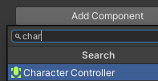
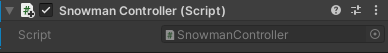

Selecteer je Player GameObject en kies **Add Component** in de Inspector en voeg een **Character Controller**toe.

Pas de collider-instellingen aan zodat de collider dezelfde hoogte heeft als de Speler en de Center y waarde de helft is van de hoogte. Pas de radius aan zodat de collider je speler bedekt.

De Character Controller-component voegt de `SimpleMove` -methode toe, die je moet aanroepen vanaf `Update` op een script dat aan de speler is gekoppeld.

Klik op **Add Component**en vervolgens op **New script**. Geef het script de naam `SimpleController` (of gebruik een naam die specifiek is voor je personage zoals `SnowmanController`.)

Klik op het script in de Inspector om het te vinden in het projectvenster, open vervolgens het script in je Code Editor.

Voeg code toe om je personage te laten bewegen op basis van toetsenbordinvoer.

--- code ---
---
language: cs filename: SimpleController.cs
line_numbers: false
---
public class SimpleController : MonoBehaviour
{ public float moveSpeed = 3.0f; // Default move speed public float rotateSpeed = 3.0f; // Default rotate speed

    // Start is called before the first frame update
    void Start()
    {
    
    }
    
    // Update is called once per frame
    void Update()
    {
        // Add player animation code here if needed
    
        // Player movement code
        CharacterController controller = GetComponent<CharacterController>();
        transform.Rotate(0, Input.GetAxis("Horizontal") * rotateSpeed, 0);
        Vector3 forward = transform.TransformDirection(Vector3.forward);
        float speed = moveSpeed * Input.GetAxis("Vertical");
        controller.SimpleMove(forward * speed);
    }
} --- /code ---

